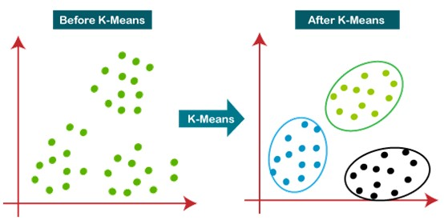

## Hello

👋 Hi, my name is Andy, come from Taiwan, with 2 years working experience as a data analyst

👀 I’m interested in Data Analytics and Data Science opportunities in the United States

🌱 I’m currently a Master Student major in Analytics at University of Southern California

💞️ I’m a highly responsible person who is also cooperative, meticulous, and innovative. Always eager to learn new things with considerable passion and curiosity. Based on my study and experiences in Data Analytics, I look forward to exploring more and applying what I have learned to business. No matter facing any challenges, I will be well prepared, adapt to new changes, and tackle them with an optimistic attitude.

📫 How to reach me: Email: wuchungm@usc.edu ; Linkedin: www.linkedin.com/in/chungmingwu

## Multi-class-and-Multi-Label-Classi-cation-With-SVM-and-K-Means-Clustering-on-Monte-Carlo-Simulation

This is one of the HW assignment at USC, there are 2 quesitons.

### First, using SVM to solve Multi-class and Multi-Label Classification on Anuran Calls (MFCCs) Data Set.

1. Using Exact Match and Hamming Score/ Loss 
2. SVM with Gaussian kernels
3. L1-penalized wity SVM -Gaussian kernels
4. SMOTE with L1-penalized in SVM -Gaussian kernels

### Second, using k-means clustering to calculate accuracy on Anuran Calls (MFCCs) Data Set in 50 runs of Monte-Carlo Simulation.  

3. K-Means Clustering
4. Using Silhouettes as a metrics
5. Calculate Hamming distance, Hamming score, and Hamming loss
6. Monte-Carlo Simulation

## Machine Learning for Data Science

## K-Means Clustering

